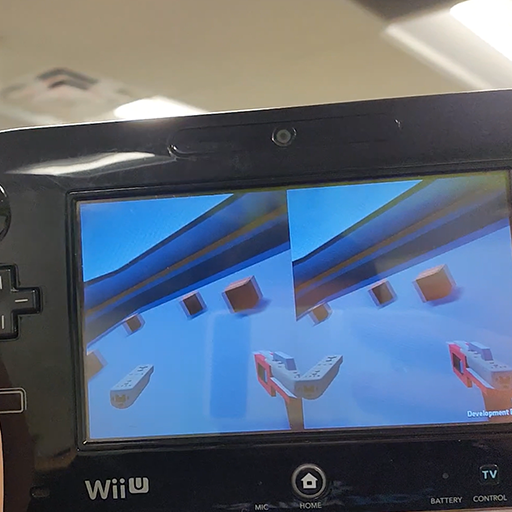
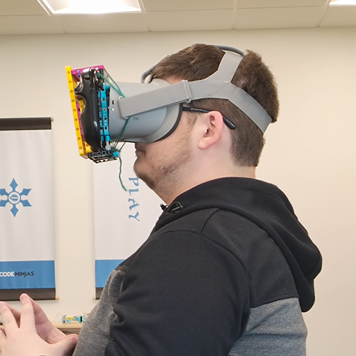
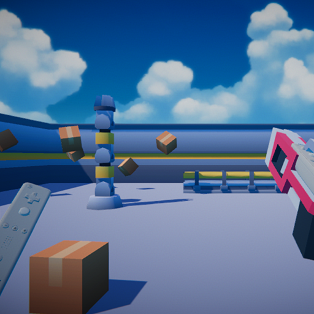

# 🧲 VR Using The Wii U 🔎

**'Experiment In Using 9-Axis Rotation Using Accelerometer, Gyroscope, and Magnetometer'**

---

This project was created to help me understand how sensors can interact together.

My research included different filtering methods and among the two I found I settled on the Madgwick filter. This filter was pioneered by Doctor Sebastian Madgwick in 2012 and I was able to various levels of success get it implemented in C# with Unity. After getting the headset to have accurate rotations, I was able to create my own Beat Saber clone using Guitar Hero songs as my method of spawning notes to the beat. This included parsing a custom .chart file that had the notes organized in a certain format with a time stamp. Then I was able to time when these notes should spawn.

Sources For Madgwick Filter
- https://youtu.be/PXHKejwjrIw
- https://www.youtube.com/watch?v=6ijArKE8vKU

Watch my video breakdown here! - https://youtu.be/PXHKejwjrIw

---

  
  
  

