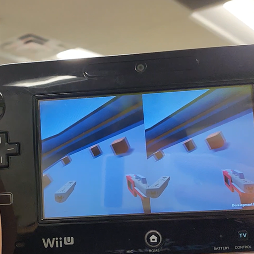
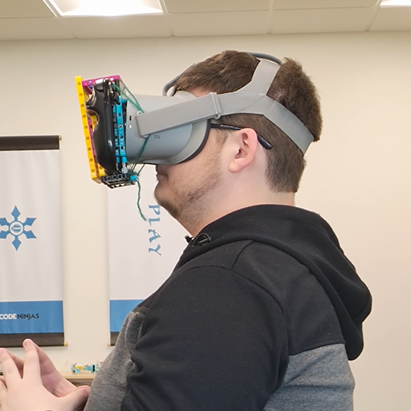
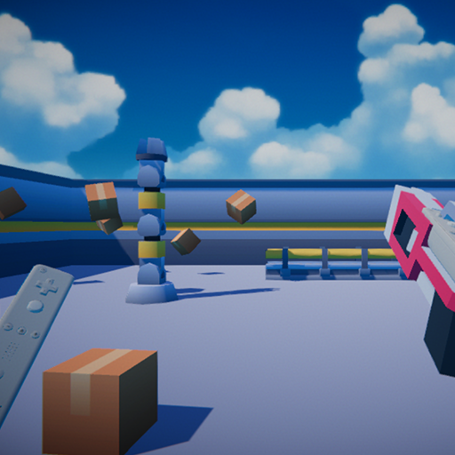

# VR Using The Wii U - 9-Axis Rotation Experiment with Beat Saber Clone

  
  
  

This project explores how sensors can interact together to create immersive VR experiences using accelerometer, gyroscope, and magnetometer data. After researching various filtering methods, I implemented the Madgwick filter - pioneered by Doctor Sebastian Madgwick in 2012 - in C# with Unity to achieve accurate headset rotations. Once the tracking system was working, I created my own Beat Saber clone that uses Guitar Hero songs to spawn notes to the beat, complete with custom .chart file parsing and precise timing systems.

Watch my video breakdown here! - [https://youtu.be/PXHKejwjrIw](https://youtu.be/PXHKejwjrIw)

While this appears to be a simple VR experiment on the surface, it has hidden complexity in sensor fusion algorithms and real-time audio synchronization. I used this project to deepen my understanding of motion tracking, filtering techniques, and rhythm game mechanics in Unity.

---
